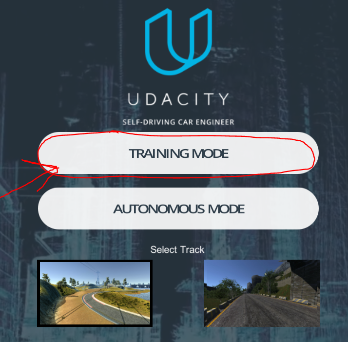

# Self-Driving Car 
## Идея
Главная идея проекта заключалась в создании нескольких моделей,которые при соединении между собой дали бы самую простую систему управления беспилотным автомобилем.
В данном проекте не используются датчики и лидары, кроме камер для данного уровня ничего не нужно. Весь проект крутится вокруг визуализациии Self-Driving Car Simulator
на движке Unity. В этой визуализации собираются даннные, на них обучается модель, и далее на ней же проверяется. 

Training | Validation
------------|---------------
 | 
### Стек использованных технологий 

- [Keras](https://keras.io/)
- [NumPy](http://www.numpy.org/)
- [SciPy](https://www.scipy.org/)
- [TensorFlow](http://tensorflow.org)
- [Pandas](http://pandas.pydata.org/)
- [OpenCV](http://opencv.org/)
- [Matplotlib](http://matplotlib.org/) 
- [Jupyter](http://jupyter.org/) 
- [PyCharm](https://www.jetbrains.com/ru-ru/pycharm/)

## Сбор данных
Первым делом необходимо собрать даннные для обучения модели. Для этого в визуализации необходимо проехать по первому треку несколько кругов в одном направлении и
несколько кругов в обратном направлении в режиме Training Mode, иначе данные будут смещены в какую-то сторону.

Training mode |
------------ |
 |
